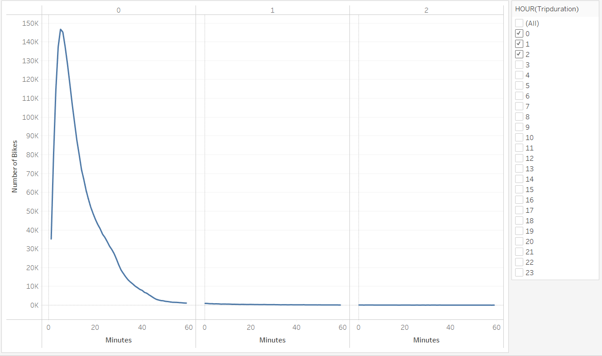
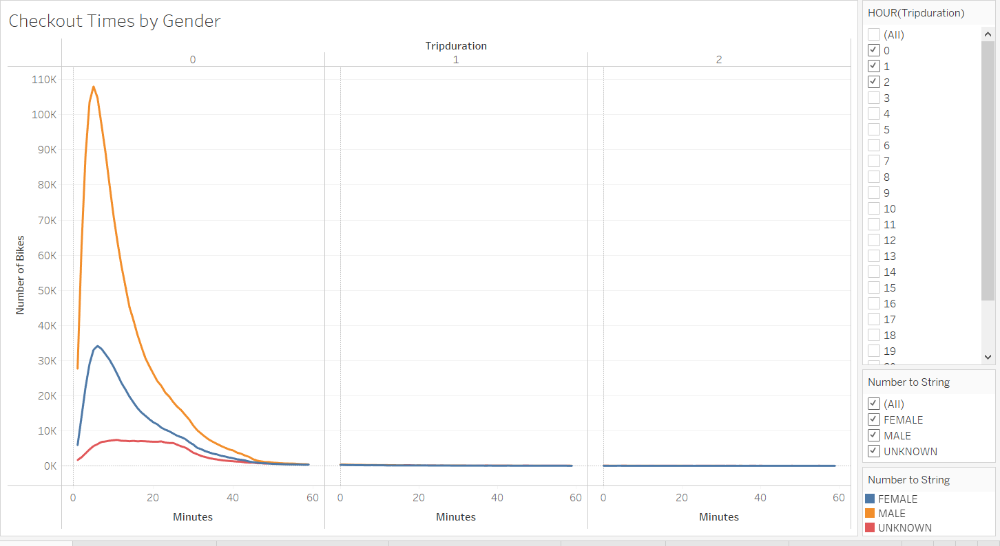
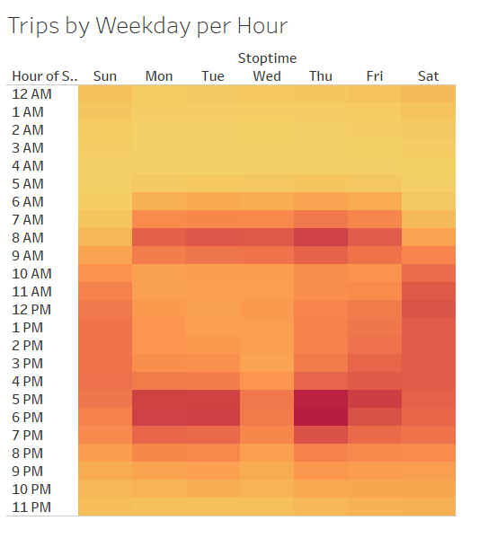
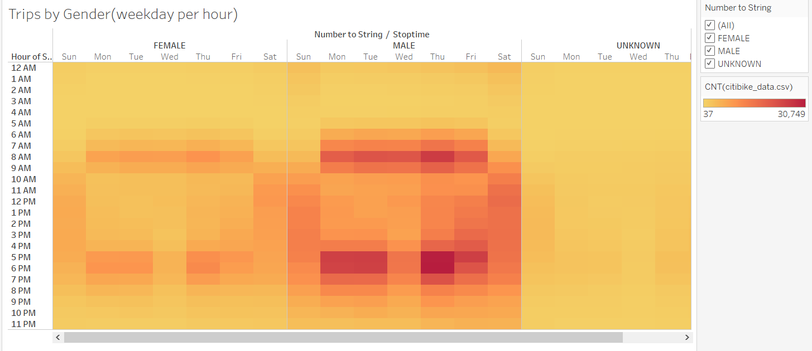
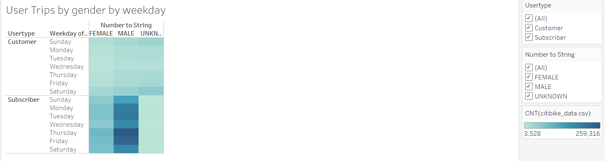
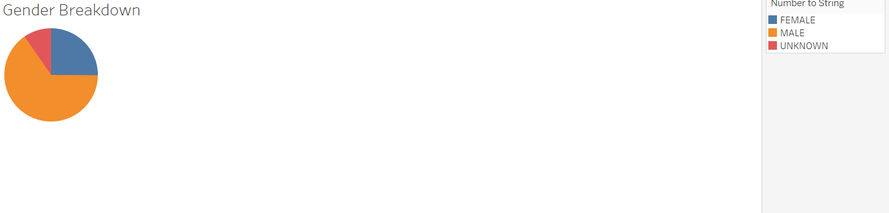
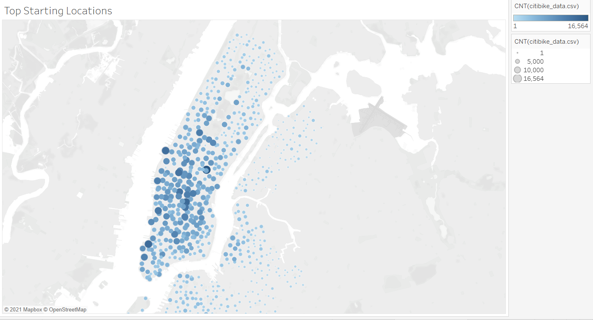

# bikeshariing

### Purpose
  The purpose of this analysis was to demonstrate data to investors to start a bike sharing venture in Des Moines, Iowa. The data comes from Citi Bike for the month of August in New York City. Using Tableau Public I was able to provide several visualizations of analysis to present to the investors a breakdown of the NYC data that would seem of interest and aid in making a decision.
  
### Results
  
  The following images are the visualizations from the NCY Citi Bike data.
  
  
  ##### The image above shows the tripduration per bikes being used, most bikes trips are shorter than an hour.
  
  
  ##### The image above shows the tripduration per bikes by gender.
  
  
  ##### The image above shows the number of bike trips by weekday per hour
  
  
  ##### The image above shows the number of bike trips by weekday per hour by gender
  
  
  ##### The image above shows the distrubution of usertype by gender and weekday
  
   
  ##### The image above shows the breakdown of all trips by gender
  
  
  ##### The image above show a map of the top starting locations in NYC
  
### Summary
  After viewing the visualiztions of the NYC citi bike data one can see that when it come to genders that males are the largest user group for bike rentals and that generally most rides are done within an hour of their startime in all genders. Another observation would be that Thursday and Friday show the most usage of rental bikes and that during the working weekday of Mon-Fri the average high start time would be 7-9am and 5-7pm. Further suggested visualizations would include the relationship between usertype and tripduration, and usertype by tripduration per gender. Please visit the Tableau Public link below to interact with the story.
  [Link to the Story!](https://public.tableau.com/app/profile/peter.chen3937/viz/NYC_citibike_anaylsis_project/NYCanalysis)
  
